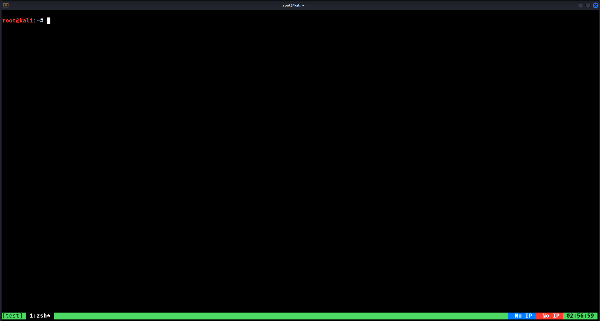

# dotfiles
My configuration files

These custom Zsh functions allow you to dynamically track your target and attacker IP addresses directly on the Tmux status bar in real-time.

### Commands

*   **Set Target IP (RHOST):**
    ```bash
    settarget <ip_address>
    ```
*   **Set Attacker IP (LHOST):**
    ```bash
    setattacker <ip_address>
    ```
*   **Clear IPs:**
    ```bash
    donectf
    ```
>   Running `donectf` instantly resets the status bar indicators back to `No IP`
---




## Installation
| **Alacritty** | [GitHub Repository](https://github.com/alacritty/alacritty) | `sudo apt install alacritty` |
| **Tmux**      | [GitHub Repository](https://github.com/tmux/tmux)           | `sudo apt install tmux`      |
| **Zsh**       | [Official Website](https://www.zsh.org/)                    | `sudo apt install zsh`       |

### Extra
```bash
sudo apt install fzf bat ccze tldr
